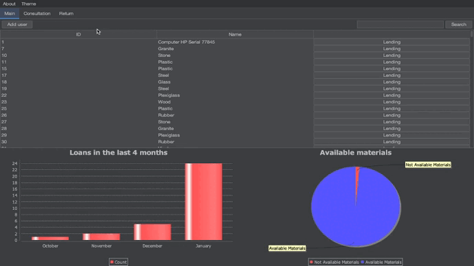
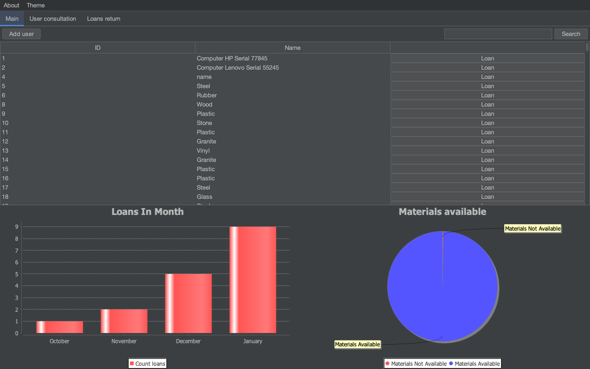
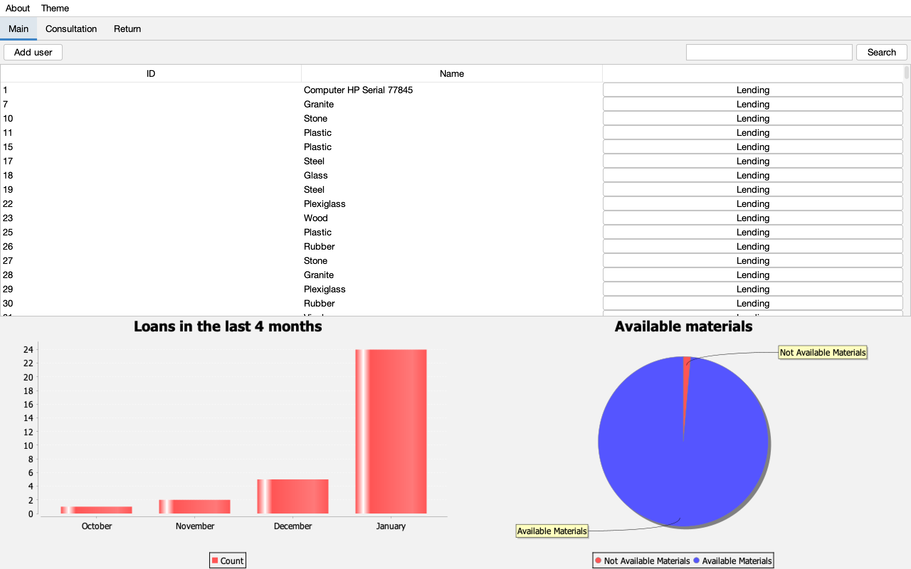

<h1 align="center">Welcome to Loans Manager 👋</h1>

  

> Loans Manager it's a mini project to manage materials 
- Add users and new loans
- Get informations about status of materials
- Display available, delayed and not available materials
- Get the log of loans for a user
- Return material
- Get informations about delayed materials and daly
- Track materials

## ✨ Demo

`Loans Manager` is able to show you how to use MVC and Observable pattern in real project with t implementation of JFreeChart and Flatlaf:

  

Themes:

<table>
<tr>
<td>

</td>
<td>

</td>
</tr>
</table>

## 🚀 Usage

Make sure you have [JDK](https://www.oracle.com/java/technologies/downloads/) installed and [MySQL](https://www.apachefriends.org/fr/index.html)

- Execute `Loans-Manager.sql` scripte in MySQL
- Add some materials using MySQL
- Run Java Project

## Design patterns
- MVC
- Observable pattern

## Technologies
- JAVA
- Swing

## Dependencies
- [JFreeChart](https://www.jfree.org/jfreechart/)
- [FlatLaf](https://github.com/JFormDesigner/FlatLaf)

## Code Contributors

This project exists thanks to all the people who contribute.

## 🤝 Contributing

Contributions, issues and feature requests are welcome. 
Feel free to check [issues page](https://github.com/AbderrahmaneAhmam/loans-manager/issues) if you want to contribute. 
[Check the contributing guide](./CONTRIBUTING.md). 

## Author

👤 **Abderrahmnae Ahmam**

- Twitter: [@AbderrahmaneAhmam](https://twitter.com/AbderrahmaneAhmam)
- Github: [@AbderrahmaneAhmam](https://github.com/AbderrahmaneAhmam)

## Show your support

Please ⭐️ this repository if this project helped you!

## 📝 License

Copyright © 2022 [Abderrahmane Ahmam](https://github.com/AbderrahmaneAhmam). 
This project is [MIT](https://github.com/kefranabg/readme-md-generator/blob/master/LICENSE) licensed.

---

_This project created with ❤️